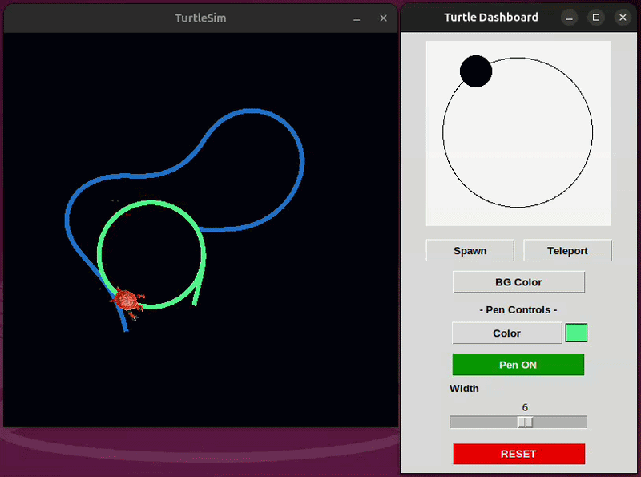
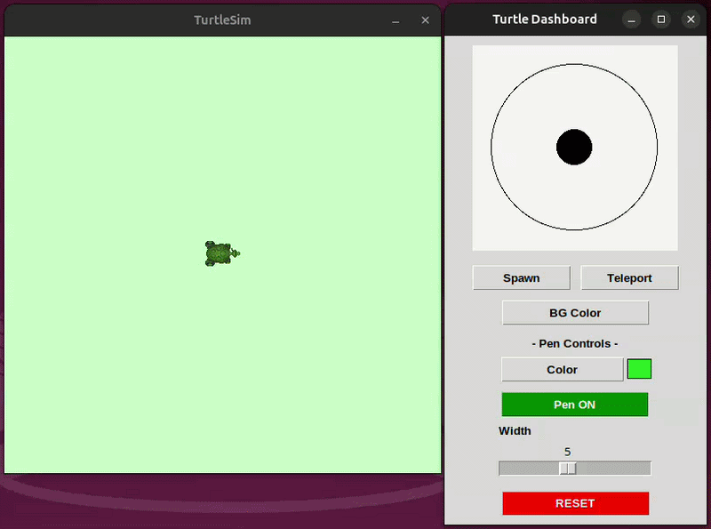
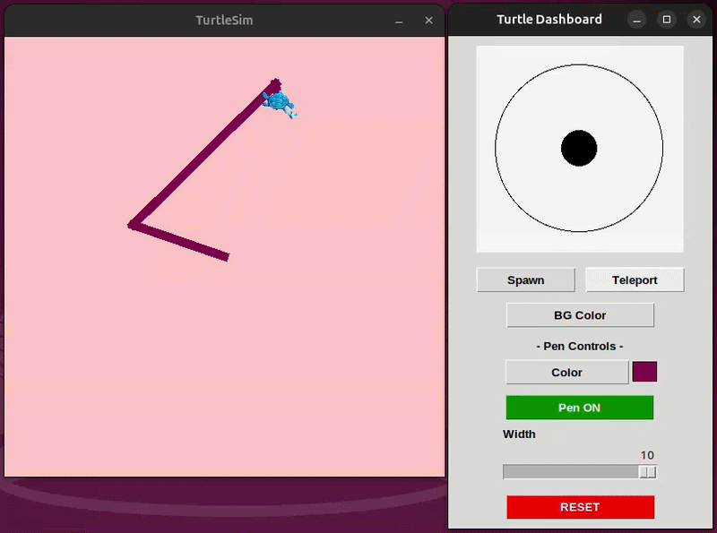

## 🎯 Purpose 

This package provides a **graphical alternative to the traditional Command-Line Interface (CLI)** for controlling TurtleSim in ROS 2. While the CLI offers precision, it requires remembering commands and message structures, which can slow down beginners. This GUI brings core functionalities—such as velocity control, spawn turtle, teleportation, pen controls, and service interactions—into a single interactive dashboard, allowing users to explore features in real time and directly connect inputs to visible outcomes.

The goal of this project is to **improve learning efficiency and engagement** by shifting from abstract, text-based interaction to a visual and hands-on approach. Research in Human-Computer Interaction shows that visual feedback and direct manipulation can improve understanding by up to **60–70%**. By reducing cognitive load and enabling combined visual and logical learning, this tool helps users build a stronger intuition of ROS 2 systems, leading to faster learning and better retention.


## ⚙️ Features

This GUI provides access to key TurtleSim functionalities through an intuitive interface:

- **Velocity Control**  
  Control both **linear** and **angular velocity** for smooth and precise movement

- **Speed Adjustment**  
  Dynamically adjust movement speed in real time

  


- **Spawn Turtle**  
  Create new turtles at desired positions

  

- **Teleportation**  
  Instantly move the turtle to a specific location

- **Pen Controls**  
  Manage turtle drawing behavior, including:
  - Pen color  
  - Pen width  
  - Enable/disable drawing  

  

> 🚀 More features will be added soon to enhance functionality and user experience.

## 🛠 Installation & Usage

Follow the steps below to set up and run the TurtleSim GUI Controller on your system.

1. **Create Workspace and src Folder**
```bash
mkdir -p ~/controller_ws/src
```

2. **Navigate to src Folder**
```bash
cd ~/controller_ws/src
```

3. **Clone the Repository**
```bash
git clone https://github.com/Pranav-s19/turtlesim_gui_controller.git
```

4. **Build the Workspace**
```bash
cd ~/controller_ws
colcon build
```
5. **Source the Workspace**
```bash
source install/setup.bash
``` 
## Running the Application

**Terminal 1: Run Controller Node**
```bash
ros2 run turtlesim_gui_controller controller_node
```
**Terminal 2: Run TurtleSim**
```bash
ros2 run turtlesim turtlesim_node
```
